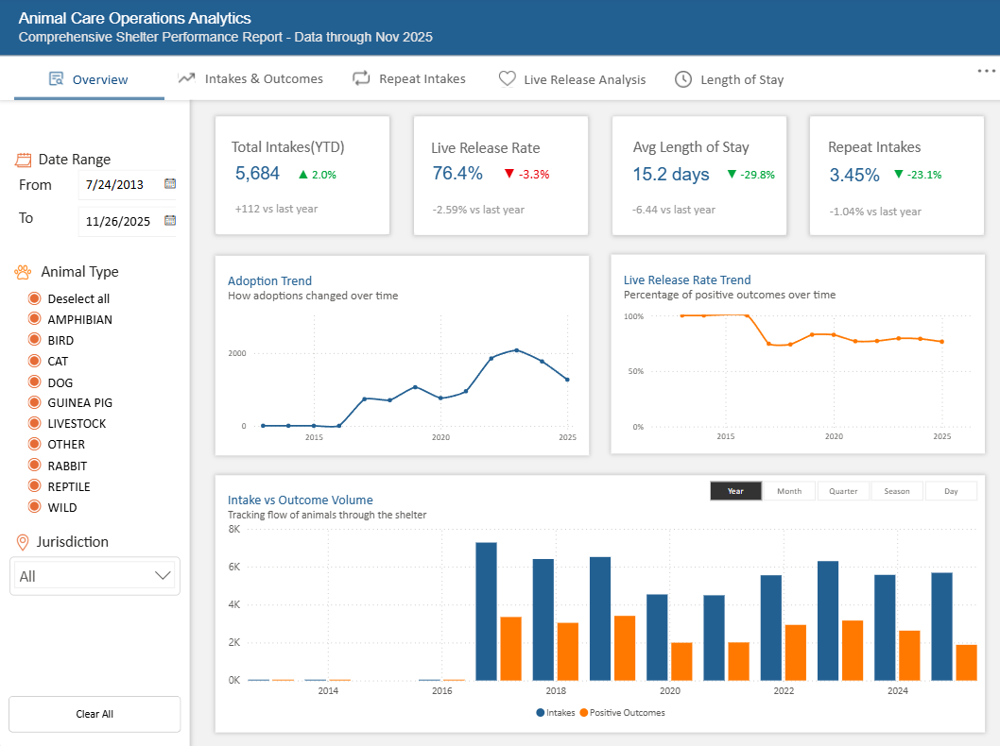

# Animal Shelter Operations Analytics

#### Overview

#### Intakes & Outcomes view

#### Repeat Intakes view

#### Live Release Analysis View

#### Length of Stay View

### Project Overview

This project was created as part of my submission for the Onyx DataDNA Challenge - December 2025, wherein I created a comprehensive five-pager report to analyze Animal Shelter Intakes and Outcomes dataset from the City of Long Beach Animal Care Services.

The goal is to create a Power BI report that uncovers operational trends, improves understanding of live-release performance, and supports data-driven decisions related to shelter capacity, resource planning, and animal welfare outcomes.

### About Data

The dataset was collected from Long Beach Animal Care Services.

  #### Data Dictionary
  | Column Name        | Description                                                                   |
  | ------------------ | ----------------------------------------------------------------------------- |
  | Kennel ID          | Identifier for the kennel or housing location                                 |
  | Animal ID          | Unique identifier assigned to each animal                                     |
  | Animal Name        | Name of the animal                                                            |
  | Animal Type        | Species of animal (Dog, Cat, etc.)                                            |
  | Primary Color      | Main coat color                                                               |
  | Secondary Color    | Secondary coat color                                                          |
  | Sex                | Sex of the animal (Male, Female, Unknown)                                     |
  | DOB                | Date of birth (if known)                                                      |
  | Intake Date        | Date the animal entered the shelter                                           |
  | Intake Condition   | Health or physical condition at intake                                        |
  | Intake Type        | Primary source of intake (Stray, Owner Surrender, Confiscated, etc.)          |
  | Intake Subtype     | More detailed intake classification                                           |
  | Reason for Intake  | Explanation for why the animal was taken in                                   |
  | Outcome Date       | Date the animal exited the shelter                                            |
  | Crossing           | Intake or outcome crossing indicator (e.g., transferred across jurisdictions) |
  | Jurisdiction       | Governing area or authority                                                   |
  | Outcome Type       | Final outcome (Adoption, RTO, Transfer, Euthanasia, etc.)                     |
  | Outcome Subtype    | Detailed outcome classification                                               |
  | latitude           | Latitude coordinate of intake/outcome location                                |
  | longitude          | Longitude coordinate of intake/outcome location                               |
  | geopoint           | Combined latitude & longitude field                                           |
  | intake_is_dead     | Animal was deceased upon intake                                               |
  | intake_duration    | Days between intake and outcome                                               |
  | is_current_month   | Intake occurred in the current month                                          |
  | outcome_is_dead    | Outcome was non-live (euthanasia, died, disposal)                             |
  | outcome_is_current | Outcome occurred in the current month                                         |
  | outcome_is_other   | Outcome not classified as live or dead                                        |
  | outcome_is_alive   | Outcome was live (adoption, RTO, transfer)                                    |
  | was_outcome_alive  | Snapshot of live outcome status                                               |

  #### Data Source
  - downloaded from onyx data dataDNA [website](https://datadna.onyxdata.co.uk/challenges/november-2025-datadna-ecommerce-analytics-challenge).

### Purpose
Our analysis should help the shelter and community partners understand where to focus strategic effort, improve placement success, and manage resources more effectively.

The following are questions that should that should be answered:
- How do intake and outcome volumes change over time (month, season, day-of-week)?
- How has the number of pet adoptions changed over the years?
- What is the shelter’s live-release rate, and how has it trended?
- Which types of pets are adopted most often?
- Which species, age groups, or breed types have higher or lower live-release rates?
- Do certain intake types or conditions lead to different outcomes?
- What is the average length of stay, and how does it vary across different animal profiles or outcome types?
- Which animals tend to stay the longest in the shelter, and what characteristics do they share?
- Are there seasonal or day-of-week intake patterns that inform staffing or resource allocation?
- Which intake sources contribute the largest volumes, and what does this imply for community outreach or prevention programs?
- Are there animals that return to the shelter more than once, and what factors predict repeat intakes?
- Which data-driven actions could most effectively improve save rates or reduce length of stay?

### Analysis
- **53,343** Total Animal Intakes in the span of 13 years (2013-2025).
- **Stray** animals consist of **70%** of the total intake source.
- **Wednesday** often receives the most intakes within a week which is **153.44%** higher than **Monday** which has the smallest intakes.

  #### Repeat Intake 
  - Overall RIR is **3.14%** suggest that repeat intakes intakes are relatively low overall.
    - There is a **-1.4%** decrease from last year which is an improvement and signals in placement stability.
  - Average Time to Return: 265 days
    -Equivalent to approximately 8.8 months, suggesting returns often occur well after initial placement.
  - Most Returned Animal: RIFLE(DOG)
    -A single dog account shows 8 repeat returns, highlighting extreme outlier behavior.
  - Repeat intake rate has:
    - Increased gradually from earlier years
    - Peaked around 2022
    - Slightly declined in the most recent period
    - The recent decline aligns with improved intake prevention or post-placement support.
    - Long-term stability remains a concern as rates have not returned to early-period lows.
  - Most repeat intakes occur:
    - Within 0–30 days, indicating failed placements or unresolved owner issues.
    - 31–90 days is the second most common return window.
  - Returns drop significantly after 90 days, suggesting:
    - Longer-term placements are more likely to be permanent.
  - A smaller but meaningful number of animals return after 1+ year, pointing to:
    - Life-change surrenders
    - Long-term owner instability rather than poor matching.
  - 3–7 year old animals show the highest repeat intake rate.
    - Likely due to behavioral, training, or lifestyle mismatch issues.
  - 1–3 year olds also show elevated return rates.
  - Puppies/kittens (0–12 months) have the lowest repeat intake rates.
  - Senior animals (7+ years) show a slight decline, possibly due to fewer placements overall.
  - Dogs have the highest repeat intake rate by a wide margin.
    - Indicates higher behavioral complexity and owner responsibility.
  - Rabbits and Cats show moderate repeat rates.
  - Wildlife, Birds, and Other species show minimal repeat intake activity.
    - Likely due to transfer-based outcomes rather than adoptions.

  #### Live Release
  - Overall Live Release Rate (LRR) is **77.9%**, indicating the majority of animals leave the shelter alive.
  - LRR shows a –2.59% decline vs last year, suggesting a recent softening in outcome performance.
  - Despite the decline, LRR remains within an operationally acceptable range, but the trend warrants monitoring.
  - Adoption Rate: 22.3%
    -Largest contributor to live outcomes.
    -Shows the steepest decline (–9.44% vs last year).
  - Owner Return Rate: 7.0%
    - Moderate contributor.
    - Declined –2.63% vs last period, possibly reflecting challenges in owner identification or reunification.
  - Transfer Rate: 3.8%
    - Smallest contributor.
    - Declined –2.02% vs last period, limiting an important pressure-release mechanism.
  - Animals aged 1–3 years have the highest live release rate, indicating peak adoptability.
  - Young animals (0–12 months) perform well but slightly below prime-age animals.
  - Senior animals (7+ years) show a decline in live release rate, suggesting:
    - Longer lengths of stay
    - Higher medical or behavioral barriers to placement
  - Age is a clear driver of outcome success and should be used for targeted interventions.
  ### Length of Stay
  - Overall Average LOS: 19.3 days
    - Improved by –6.44 days vs last year, indicating operational gains.
  - Median LOS: 5 days
    - Highlights that most animals are placed quickly.
    - Large gap between median and average suggests a small number of long-stay outliers.
  - Animals with LOS > 60 days: 4,248
    - Represents 8.1% of total animals.
    - This small segment likely consumes a disproportionate share of resources.
  - Longest Current Stay: 1,157 days
    - Single long-stay case (dog, 5 years old) significantly skews average LOS metrics.
  - LOS declined to a low point around 2015–2016, indicating efficient placement during that period.
  - A sharp increase is observed between 2018–2021, likely reflecting: 
    - Intake mix changes
    - Capacity constraints
    - External disruptions (e.g., staffing, policy, or environmental factors)
  - Recent years show a downward trend, suggesting recovery and improved throughput.
  - Despite improvements, LOS has not yet returned to historical lows.
  - Rabbits have the longest average LOS, indicating limited adoption or transfer pathways.
  - Guinea Pigs and Cats also experience longer shelter stays.
  - Dogs show moderate LOS despite higher intake volumes.
  - Livestock, Reptiles, Wildlife, and Birds have very short LOS:
    - Likely driven by rapid transfers or species-specific protocols.
  - 1–3 years and 3–7 years animals experience the longest stays.
    - Prime-age animals may face behavioral or matching challenges.
  - 0–6 months animals have relatively high LOS, likely due to:
    - Medical holds
    - Foster dependency
  - 6–12 months show improved placement speed.
  - Senior animals (7+ years) have moderately elevated LOS.

### Recommendations
 - Implement 30-day and 90-day post-adoption follow-ups, especially for dogs.
 - Expand behavioral support and training resources for 1–7 year old animals.
 - Flag high-return animals for specialized foster or placement pathways.
 - Strengthen pre-adoption matching for high-risk animal types.
 - Expand senior animal adoption and foster programs to lift lower-performing age groups.
 - Strengthen return-to-owner workflows, especially for species with lower adoption likelihood.
 - Reinforce transfer partnerships to offset adoption volatility.
 - Monitor adoption rate trends closely as an early warning indicator of live release performance.
 - Create long-stay intervention programs for animals exceeding 60 days.
 - Prioritize behavioral support and targeted marketing for 1–7 year old animals.
 - Develop species-specific partnerships for rabbits and small mammals.
 - Track longest current stay animals as a real-time operational risk metric.
 
### Refer
  - refer to my [post](https://www.linkedin.com/posts/batchaaan22_datafam-datadna-datavisualization-activity-7406541678737620992-pH-D?utm_source=share&utm_medium=member_desktop&rcm=ACoAADU37-4BvZkdxoNILB6GhzRJGT7OoLWMMoY) for my submission.
